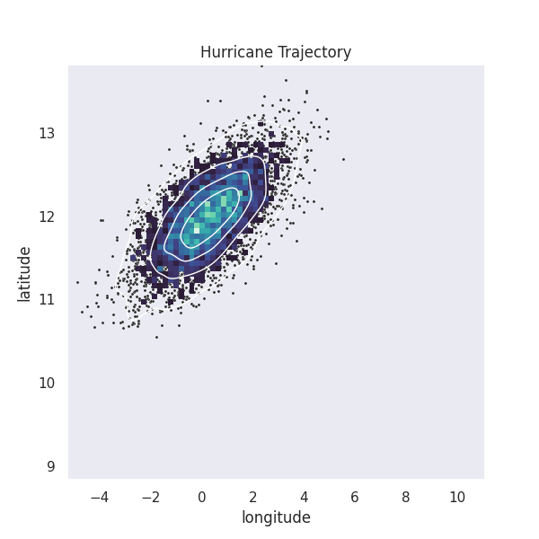

*******
datagif
*******

A Python package for easily making clean animated gifs of data plots, `datagif` is built on top
of `seaborn <https://seaborn.pydata.org/>`_ to manage the plot generation, and
`imageio <https://imageio.github.io/>`_ to manage creating the animated gif.

Example GIF
***********
Code for this example can be found in the `examples directory <https://github.com/Matyasz/datagif/blob/master/examples/scatterplot.py>`_.

How to use `datagif`
####################
The method you need is named after the package, so use the following import statement

.. code-block:: python

   from datagif import datagif

Your data will need to be in the form of a `pandas` DataFrame, with at least three columns.
Select one to be the time dimension, and then the simplest example looks like the following

.. code-block:: python

    datagif(
        plots='scatterplot',
        save_dir='/path/to/plot/dir',
        name='GIF',
        data=df,
        x='x',
        y='y',
        t='time'
    )

Customizing your GIF
####################
There are four important arguments for customizing your GIF and the plots that make it up:

- plt_funcs (Functions that are normally called like `plt.title()`)
- seaborn_funcs (Functions that are normally called like `sns.set_theme()`)
- seaborn_args (Arguments to add to the plot functions)
- imageio_args (Arguments for the imageio `get_writer()` method)

For the `_funcs` arguments, these should be in the form of a dict where the keys are strings of the
names of the functions you want to call, and the values should be the arguments you want to pass to
the functions. These values can themselves be 

- a single value, like a string
- a list to be unpacked and passed to the function
- a dictionary to be unpacked and passed to the function as keyword arguments

For the `_args` arguments, these should be in the form of a dict that will be passed to the
plotting and imageio functions as keyword arguments.

Using multiple plots in one GIF
###############################
As in the example above, you can layer multiple plots in one GIF! To do this, simply make the
`plots` argument a list of valid strings. Then also make the `x`, `y`, `seaborn_args` arguments
into lists of valid values the same length as the `plots` list, and the n\ :sup:`th`\  entry of
these other arguments will be used for the n\ :sup:`th`\  plot.

Helpful Tips
############
It is strongly recommended to use the `tight_layout` method in the `plt_funcs` argument.
This will help prevent small differences between the plots produced, leading to a much
cleaner GIF.